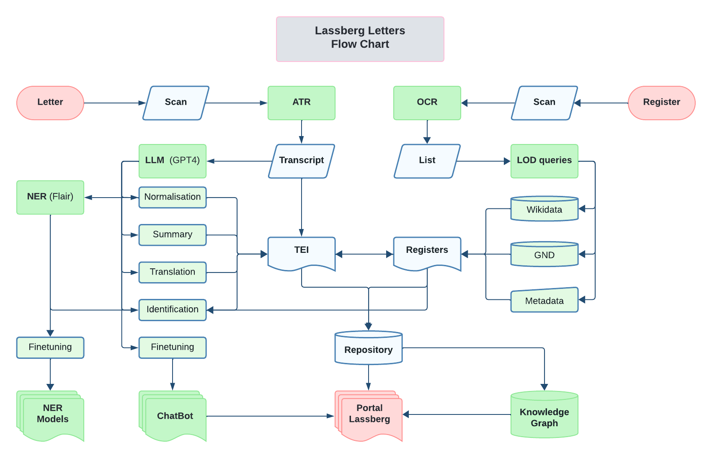

# The Lassberg Letters
*Disclaimer: Code and dataset of this repository is still under development and may change substantially. Thus, it is not meant for citation at this point. If sufficiently prepared, the data will be made available as a citeable source via zenodo.*

## Overview
This repository is dedicated to Joseph von Laßberg, an important German scholar of medieval literature in the 18th and 19th century. The repository focuses on collecting, analyzing and encoding Laßberg's vast correspondence of 3265 known letters, mainly focused on the study of medieval history and literature.  Eventually, the correspondence is supposed to be available as TEI encoded XML-files including metadata and the letter's texts. To tackle this massive amount of letters and to make them accessible for research, machine learning applications will be tested and used, such as Automated Text Recognition, Named Entity Recognition (NER) and Large Language Models (LLM) to automate summarizing and normalisation, as well as Topic Modelling. Lastly, a quantitative analysis of the data will be available.

## Technical Documentation
Here is the documentation for your project, presented as a coherent text.

### From PageXML to Enriched TEI
The project develops a multi-stage pipeline designed to transform raw PageXML transcriptions into enriched and linkable TEI data. Its primary goal is to move beyond automted text transcription by performing **Named Entity Recognition (NER)** and **Entity Linking** leading to a dedicated JSON file for each document, containing a clean, deduplicated, and reliable list of all persons, places, and literary works, with each entity linked to a specific ID in local register files files (registers).

The pipeline's philosophy is built on two key strategies. First, instead of relying on one imperfect model, it first runs **four different NER models** to achieve a high recall, gathering a potentially noisy net of all possible entities. It then feeds this noisy data to an **LLM Agent** to filter, cleaning, merging duplicates, and removing false positives to achieve a high precision.

Second, for entity linking, it uses an efficient combination of fuzzy-search/LLM hybrid. It first attempts a fast fuzzy-string match. Only if this match is ambiguous (e.g., two people with the same last name) it engages the more ressource expensive LLM, using the entity's textual context to make a more 'intelligent' decision. The entire pipeline always documents each step and caches its output to skip any steps for which an output file already exists on retry, saving significant time.

### The Data Pipeline
The pipeline's execution is controlled by `main.py`, which manages the flow of data from one module to the next. The process begins when the user either selects documents interactively (via the `file_selection` module) or provides a text file of document IDs. For each selected document, `main.py` first calls the `pagexml_to_tei` module. This module finds all relevant PageXML files from Transkribus or eScriptorium and generates two text files: a `...-tei-lines.txt` file and, most importantly, a `...-plain.txt` file. This plain text version serves as the input for the entire NER workflow.

This plain text file is passed to the `ner.py` module, which begins the NER step. This script runs the text through four different models: **hmBERT**, **Flair Base**, **HF-Default**, and **Flair Large**. A key architectural feature is how it handles the "Flair Large" model, which has dependency conflicts with `hmBERT`. The script solves this by running Flair Large in a separate **subprocess**, calling a dedicated Python executable from a `.german_large/` virtual environment. This isolates the conflict and allows all four models to run successfully. The raw, often conflicting, results from all four models are aggregated into a single noisy file: `...-ner_raw.json`.

This noisy JSON is the input for the next step, handled by `llm_adjudicate.py`. This module uses the `saia_client` to send the entire letter text and the raw NER results to an LLM via Saia Api. The LLM is given a detailed prompt instructing it to act as a "historical adjudicator." Its job is to merge duplicates, normalize labels (e.g., `B-PER` to `PER`), and drop false positives. Critically, this step preserves original character offsets. The LLM does not invent new `start`/`end` positions; it copies the reliable offsets from the original models into an `evidence.mentions` array. The output is a clean, deduplicated, and authoritative `...-ner_final.json` file.

Finally, this clean `...-ner_final.json` file is passed to `link_entities_llm.py` for the linking stage. This module first loads local XML registers (`lassberg-persons.xml`, etc.) into memory. Then, for each entity, it performs its fuzzy check using `rapidfuzz`. If the best fuzzy match is above the `fuzzy_threshold` (e.g., 92%), it's considered an automatic link. If the match is ambiguous, the script moves to its "LLM-fallback" stage. It builds a new, small prompt containing the entity's *textual context* and the top 5-6 register candidates, asking the LLM to decide. This hybrid approach is both fast and accurate.

This final step enriches the entities with register IDs and saves the result as `...-entities-linked.json`. The entire process is supported by the `saia_client`, a central utility that provides a `chat_json` method, allowing both the adjudication and linking scripts to reliably get structured JSON data from the LLM.

## Roadmap
This repository is developed in six steps:
1. Digital registers have been prepared using Harris 1991 as a starting point. Harris' register has been digitized and enriched considerably by adding and retrieving GND data via `http://lobid.org/gnd/` and Wikidata.
2. TEI encoded registers of persons and places have been created. 
3. A TEI XML template has been created that works for the encoding of each letter following [correspsearch guidlines](https://correspsearch.net/de/dokumentation.html).
4. An OxygenXML framework has been created for easy markup of the letters (`./oxygen-actions`and `oxygen-framework`).
5. An automated Worflow has been created for processing scanned letters (`./src/main.py`).
6. Data analysis is developed as a Jupyter Notebook (`./analysis/Jupyter Notebooks`)
7. Cypher import is developed for easy import of data to local [Neo4J](https://neo4j.com) installation (`./neo4j/import-data.cql`)
8. Scanning of letters
9. Processing of letters

## Dataset
Data can be found in `data`, python-scripts used for processing are stored in `src` with log-files in `log`. `data/register` contains a register of all letters with relevant meta- and linked data in `./data/register/register.csv` (';'-separated) as final version. It is based on Harris 1991, but substantially enriched by linked data and digital facsimile, wherever possible. From this file, tei-encoded person- and place-registers have been created as `./data/register/lassberg-persons.xml` and `./data/register/lassberg-persons.xml`, respectively `unique_persons.csv` and `places_persons.csv`. In this process, coordinates have been added to places and GND data has been retrieved for each person. This data was stored as json-files in `data/gnd` using gnd-number as filenames. Based on the final register, each letter's metadata was encoded as TEI in `data/letters` using a unique project id as filename. The letter's text (as well as summaries, named entities and key topics) will be added to each of these files starting with the large correspondence between Laßberg and Johann Adam Pubilofer[Johann Adam Pupikofer](https://de.wikipedia.org/wiki/Johann_Adam_Pupikofer). Processed letters can be found in `data/letters`.

## Workflow

1. **Scanning as Input:** The workflow begins with scanned letters provided by libraries and archives.
2. **Text Recognition**: The scanned documents undergo text recognition using [Transkribus](https://readcoop.eu/de/transkribus/) based on a dedicated model.
3. **Scripted Python Pipeline**: The recognized text then enters a Python pipeline, which includes several stages:
    * Transformation into TEI Format: Converting the text into the Text Encoding Initiative (TEI) format.
    * Named Entity Recognition (NER) with Flair: Flair is used for NER ([ner-german-large](https://huggingface.co/flair/ner-german-large)) to identify and categorize entities in the text, mainly persons and places. 
    * Identification: [GPT4](https://platform.openai.com/docs/models/gpt-4-and-gpt-4-turbo) is used for identifying recognized entities based on existing registers.    
    * Normalization: Transcriptions are standardized to ensure full text searchability by [GPT4](https://platform.openai.com/docs/models/gpt-4-and-gpt-4-turbo).
    * Translation and Summary with GPT-4: [GPT-4](https://platform.openai.com/docs/models/gpt-4-and-gpt-4-turbo) is employed for translating the letters into English and generating German summary.
4. **Export as TEI-XML File**: The processed text is exported in the TEI-XML format, suitable for further processing and analysis.
5. **Post-processing**: The TEI-XML files are post-processed using OxygenXML Editor within the Lassberg framework, involving manual correction and further markup.
6. **Presentation / Analysis**:
    * GitHub Pages: The final data is presented on GitHub Pages, featuring frontend data queries implemented with Vue.js.
    * Data Analysis: Data analysis is conducted through Jupyter Notebooks.
    * Local Neo4J Instance: A local Neo4J database instance is used for data management, with imports facilitated by provided Cypher code.
7. **Long-term Archiving**: Final data will be archived [Zenodo](https://zenodo.org/), ensuring its preservation and accessibility for future research and reference.

## Literature
Harris 1991: Harris, Martin: Joseph Maria Christoph Freiherr von Lassberg 1770-1855. Briefinventar und Prosopographie. Mit einer Abhandlung zu Lassbergs Entwicklung zum Altertumsforscher. Die erste geschlossene, wissenschaftlich fundierte Würdigung von Lassbergs Wirken und Werk. Beihefte zum Euphorion Heft 25/C. Heidelberg 1991.