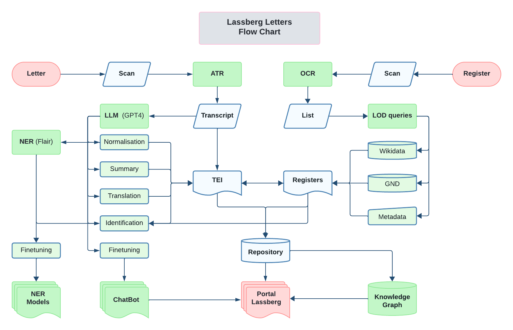

# The Laßberg Letters

*Disclaimer: Code and dataset of this repository are still under development and may change
substantially. They are not meant for citation at this point. Once sufficiently prepared, the
data will be made available as a citeable source via [Zenodo](https://zenodo.org/).*

## Overview

Joseph von Laßberg (1770–1855) was a German antiquarian and scholar of medieval literature whose
surviving correspondence - 3,268 known letters exchanged with 372 correspondents - documents the
scholarly network behind the emergence of German medieval studies. This repository collects,
encodes, and analyzes that correspondence as a digital scholarly edition: TEI-XML files with
linked entities, a set of authority registers, a static website, and a set of computational
research tools built on top of the encoded data.

The project is a collaboration between the Universität Bern, the Technische Universität
Darmstadt, and the Akademie der Wissenschaften und der Literatur | Mainz. The edition website is
published via GitHub Pages from this repository.

## Current state

- **3,268 letters** recorded in the master register (`data/register/lassberg-letters.xml`),
  based on Harris 1991 and enriched with GND/Wikidata links, provenance, and facsimile URLs.
- Authority registers: 673 persons, 310 places, 224 works of literature, and a register
  of manuscript/print exemplars (`data/register/lassberg-*.xml`).

## The website

A static site, no build framework: the root `index.html` is the welcome page; `html/letters.html`,
`html/persons.html`, and `html/places.html` are filterable register pages. `html/letters/` holds
one page per encoded letter, each marked as reviewed edition or preview, labelled with its text
source (manuscript transcription vs. print OCR), and carrying a precomputed "related letters"
block that combines embedding similarity with knowledge-graph evidence (shared mentions,
correspondence context). `html/explore.html` adds a corpus
overview (timeline and correspondents from the register metadata of all 3,268 letters, a map of
sending and mentioned places, historical persons, contemporary persons, and works the letters
discuss), semantic search over the full texts, graph exploration with a SPARQL console, and
GraphRAG retrieval, all running client-side. The GraphRAG tab has two modes: a keyless
retrieval-only pipeline, and an LLM-orchestrated research chat with a user-supplied API key
(Anthropic, OpenAI, Google Gemini, SAIA, or any OpenAI-compatible endpoint) the model itself
formulates semantic queries, writes SPARQL against the edition RDF, traverses the knowledge
graph, reads letters, and synthesizes a cited answer with every tool call being shown as a visible
trace. Keys stay in the browser. (Note: SAIA's API currently rejects browser CORS preflights.) The persons and places registers link each
entry into the graph view.

The register and letter pages are generated from the TEI sources with the XSLT stylesheets in
`oxygen-framework/lassberg/xslt/` (Saxon-HE, vendored under `tools/saxon/`). Page data for the
Explore tools comes from the pipeline described below.

## From scan to TEI: the encoding pipeline (`src/`)

New letters enter the edition through a Python pipeline (`src/main.py`) that turns Transkribus/
eScriptorium PageXML exports into TEI with linked entities:

1. PageXML is converted to plain text and TEI line files (`pagexml_to_tei.py`).
2. Four NER models (hmBERT, Flair Base, HF default, Flair Large) run over the text for high
   recall; their combined, noisy output is adjudicated by an LLM that merges duplicates and
   drops false positives while preserving the original character offsets (`ner.py`,
   `llm_adjucate.py`).
3. Entities are linked to the local registers, fuzzy matching first (`rapidfuzz`), with an LLM
   fallback only for ambiguous cases (`link_entities_llm.py`).

LLM calls go through `saia_client.py` (OpenAI-compatible AcademicCloud endpoint). Each stage
caches its output next to the source files and is skipped on rerun. Setup, credentials, and the
deliberate two-virtualenv split for conflicting NER dependencies are documented in `CLAUDE.md`
and the module docstrings. The results are post-processed manually in OxygenXML using the
framework in `oxygen-framework/` and the custom actions in `oxygen-actions/`.

A reworking of this pipeline using dedicated claude skills is ongoing.

## AI-Infrastructure (semantic search, graph, RDF, MCP server)

A second, independent pipeline builds a reproducible set of
static artifacts from the TEI data including embeddings, a Neo4j graph, an RDF/Turtle dump, precomputed
UMAP/HDBSCAN clustering, an MCP server for Claude Desktop/agents, and the website's Explore page
(`html/explore.html` + `js/explore/`) with semantic search, cluster visualization, and a
client-side GraphRAG retrieval mode. It reads `data/letters/` and `data/register/` as input and
writes to `build/`, `embeddings/`, `clustering/`, `graph/`, `rdf/`, and `json/explore/`, all
committed as static artifacts.

### Quickstart

```bash
python3 -m venv .venv-infra
source .venv-infra/bin/activate
pip install -r requirements-infra.txt
make all
```

Run `make parse embed cluster rdf explore` instead of `make all` to skip the Neo4j step if Docker
isn't available. Run `make status` after changing letter files or the letters register — it
validates the status model and reports drift. See the `edition-pipeline` Claude Code skill
(`.claude/skills/edition-pipeline/`) for the full workflow under developement and evaluation.

### Artifacts

| Directory | Contents | Built by |
|---|---|---|
| `build/` | `letters.jsonl` (all 3,268 letters, 170 with full text), `entities.json` (persons/places/works/witnesses), `manifest.json`, `warnings.log` | `scripts/parse_tei.py` |
| `embeddings/bge-m3/` | BGE-M3 letter embeddings (float16 safetensors) | `scripts/embed.py` |
| `clustering/` | UMAP 2D projection + HDBSCAN cluster assignments/labels (internal corpus-triage artifact, not shipped to the website) | `scripts/cluster.py` |
| `graph/import.cypher` | Idempotent Cypher import script (Neo4j) | `scripts/export_cypher.py` |
| `rdf/edition.ttl` (+ `cmif.xml`) | CMIF/correspSearch-vocabulary RDF dump (+ classic TEI-CMIF) | `scripts/export_rdf.py` |
| `json/explore/` | Data for the Explore page and letter pages: quantized search vectors, letters index, graph.json, corpus overview, precomputed related-letters, RDF copy | `scripts/export_frontend.py`, `export_graph_json.py`, `export_overview.py`, `export_related.py`; UI in `js/explore/` |
| `mcp_server/` | FastMCP server (semantic search, graph query, SPARQL, get_letter) for Claude Desktop | see `mcp_server/README.md` |

Runtime services (`docker-compose.yml`): Neo4j (`make graph`) and Oxigraph (`make sparql`) are
disposable — both are fully reconstructible from the committed artifacts at any time.

**Superseded by this pipeline** (kept in the repo for reference, not deleted, not further
maintained): `neo4j/import-data.cql` (hand-written predecessor of `scripts/export_cypher.py`),
`rag/` (experimental Chroma/Neo4j chat scripts, predecessor of the MCP server + browser
GraphRAG), and `data/register/register_cmif_output.xml` (superseded by `rdf/cmif.xml`,
`make cmif`). The root `main.js` and `json/letters_json.json` are remnants of an earlier Vue.js
frontend and are no longer loaded by any page.

## Repository layout

| Path | Contents |
|---|---|
| `data/` | TEI sources: letters, registers, cached GND lookups, working data (see `docs/TEI.md` for the encoding conventions and the letter status model) |
| `docs/` | TEI documentation, evaluation of the Explore tools |
| `src/` | PageXML → TEI encoding pipeline |
| `scripts/` + `Makefile` | AI-Infrastructure pipeline and status-model tooling |
| `html/`, `js/`, `css/`, `json/`, `index.html` | The static website |
| `oxygen-framework/`, `oxygen-actions/` | OxygenXML editing framework and custom Java actions |
| `analysis/` | Jupyter notebooks (quantitative/network analysis) |
| `mcp_server/`, `rdf/`, `graph/`, `embeddings/`, `clustering/`, `build/` | AI-Infrastructure artifacts and services |
| `tests/` | Pipeline unit tests (`make test`) |

## Workflow (under developement)



1. **Scanning**: libraries and archives provide scans of the letters; scan availability per
   letter is tracked in the register (`<note type="scan">`).
2. **Text recognition**: Transkribus HTR with a dedicated model.
3. **Encoding pipeline**: TEI conversion, NER, LLM adjudication, entity linking (see above);
   normalization, English translation, and German summaries are added as further `<div>`
   versions of each letter.
4. **Manual post-processing**: correction and markup in OxygenXML; a letter is published on the
   website once its encoding has been reviewed (`docs/TEI.md`, "Statusmodell").
5. **Presentation and analysis**: the static website (registers, letter pages, Explore tools),
   Jupyter notebooks, and a local Neo4j instance.
6. **Long-term archiving**: final data will be archived on Zenodo.

## Literature

Harris 1991: Harris, Martin: Joseph Maria Christoph Freiherr von Lassberg 1770–1855.
Briefinventar und Prosopographie. Mit einer Abhandlung zu Lassbergs Entwicklung zum
Altertumsforscher. Beihefte zum Euphorion 25/C. Heidelberg 1991.
